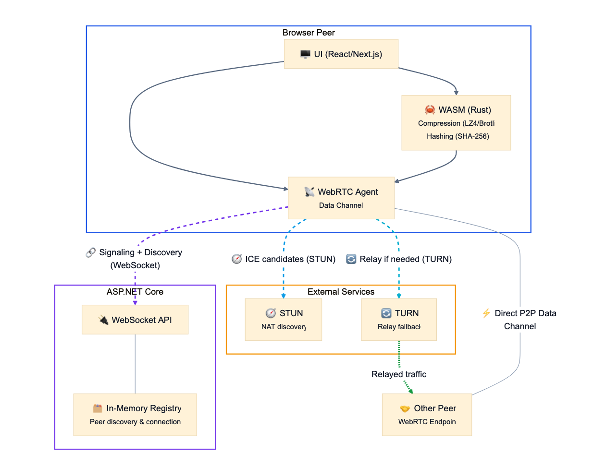
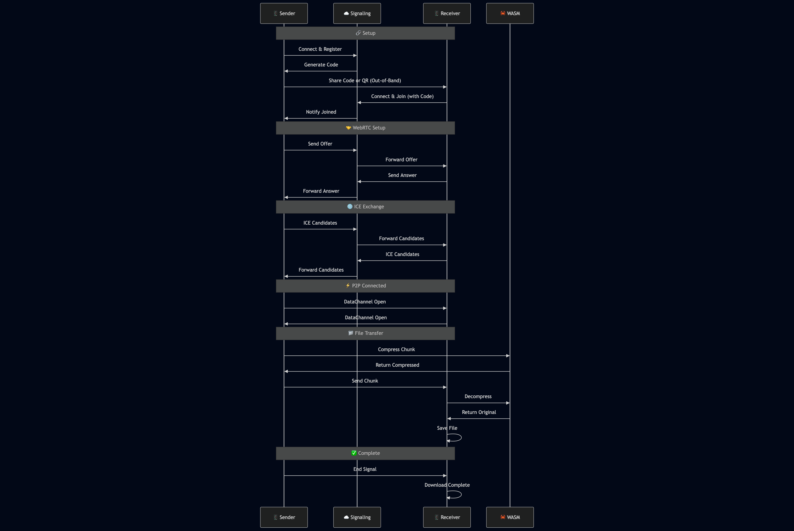

# SquareSpheres Platform - Project Showcase

> **🚧 Work in Progress** - This project is in early development. The architecture and vision are established, but many features are still being implemented.

A modern, peer-to-peer file sharing application built with WebRTC data channels, featuring real-time file compression and secure direct transfers between browsers.

## 🌟 Project Vision

SquareSpheres Platform is a file sharing application that enables direct transfers between users without uploading files to any server. Files are transferred directly between browsers using WebRTC data channels, with optional compression handled by Rust WebAssembly modules.

**Key Goals:**
- Zero-server file storage (privacy-focused)
- Real-time compression for bandwidth efficiency
- Cross-platform browser compatibility
- Modern, intuitive user interface
- Production-ready deployment infrastructure

## 🏗️ Planned Architecture



## 🔄 Planned File Transfer Flow



## ✅ Currently Implemented

### 🖥️ Frontend Foundation
- **✅ Next.js 14 Setup**: Modern React framework with TypeScript
- **✅ Tailwind CSS**: Utility-first styling framework
- **✅ Basic UI Components**: Drag & drop interface, file selection
- **✅ Responsive Design**: Mobile-first approach
- **✅ Development Infrastructure**: Hot reload, build pipeline

### 🦀 Rust WASM Module
- **✅ Project Structure**: Cargo.toml with wasm-bindgen setup
- **✅ Build Pipeline**: wasm-pack integration with frontend
- **✅ Function Skeletons**: Placeholder functions for compression/decompression
- **✅ Dependencies**: sha2, hex, serde for future hashing features

### 📡 Signaling Server
- **✅ ASP.NET Core 9.0**: Modern .NET framework setup
- **✅ WebSocket Infrastructure**: Basic WebSocket endpoint handling
- **✅ Service Architecture**: ConnectionHandler, MessageHandler, SignalRegistry
- **✅ Message Types**: Defined protocol for host/join-host communication
- **✅ Health Endpoints**: Basic health check implementation
- **✅ Docker Support**: Multi-stage build with health checks
- **✅ Fly.io Deployment**: Production deployment configuration

### 🐳 Infrastructure & DevOps
- **✅ Docker Compose**: Multi-service orchestration
- **✅ Makefile**: Comprehensive build and development commands
- **✅ Setup Scripts**: Automated development environment setup
- **✅ Multi-stage Builds**: Optimized container builds
- **✅ Health Monitoring**: Container health checks

## 🚧 In Progress / Partially Implemented

### 🔗 WebRTC Integration
- **🔄 Sender Logic**: Basic WebRTC sender hook with connection setup
- **🔄 Receiver Logic**: Basic receiver page with connection UI
- **🔄 ICE Candidate Handling**: Framework for candidate exchange
- **🔄 Data Channel Setup**: Basic data channel creation and management

### 📁 File Processing
- **🔄 Chunked Transfer**: Basic file chunking implementation
- **🔄 Progress Tracking**: UI for transfer progress display
- **🔄 WASM Integration**: Basic integration with frontend

## 📋 Planned Features (Not Yet Implemented)

### 🌐 WebRTC Protocol Implementation
- **❌ Complete Signaling Integration**: Full WebSocket message handling
- **❌ ICE Candidate Exchange**: Complete STUN/TURN integration
- **❌ Connection Establishment**: Full P2P connection setup
- **❌ Data Channel Optimization**: Reliable file transfer over WebRTC

### 🗜️ File Compression & Processing
- **❌ Real Compression**: LZ4, Zstandard, or similar compression algorithms
- **❌ File Hashing**: SHA-256 or similar for integrity verification
- **❌ Resume Transfers**: Resume interrupted file transfers
- **❌ Batch Transfers**: Multiple file support

### 🔒 Security & Privacy
- **❌ End-to-End Encryption**: File encryption before transfer
- **❌ Certificate Pinning**: WebRTC security hardening
- **❌ Input Validation**: Comprehensive input sanitization

### 📱 User Experience
- **❌ QR Code Generation**: Easy connection sharing
- **❌ Connection Status**: Real-time connection state display
- **❌ Error Handling**: Graceful error recovery
- **❌ Mobile Optimization**: Touch-friendly interface improvements

## 🛠️ Development Setup

### Prerequisites
- **Docker & Docker Compose**: Container orchestration
- **Rust & wasm-pack**: WASM module compilation
- **.NET 9.0+**: Signaling server development
- **Node.js 18+**: Frontend development

### Quick Start
```bash
# Clone and setup
git clone <repository>
cd squarespheres-platform
./scripts/setup-dev.sh

# Start development environment
make dev

# Access applications
# Frontend: http://localhost:3000
# Signaling Server: http://localhost:8080
```

### Available Commands
```bash
make help          # Show all available commands
make build         # Build all components
make dev           # Start development environment
make dev-local     # Start with local toolchain
make test          # Run all tests
make clean         # Clean build artifacts
make logs          # View service logs
make health        # Check service health
```

## 🌐 WebRTC Protocol Overview

### What is WebRTC?
WebRTC (Web Real-Time Communication) is a collection of protocols and APIs that enable real-time communication between browsers without requiring plugins or native applications.

### Key Components:

#### 1. **STUN/TURN Servers**
- **STUN (Session Traversal Utilities for NAT)**: Helps discover public IP addresses and NAT types
- **TURN (Traversal Using Relays around NAT)**: Provides relay servers when direct P2P connection fails
- **Purpose**: Enables connections between peers behind firewalls/NATs

#### 2. **Signaling Server**
- **Role**: Coordinates connection establishment between peers
- **Functions**: 
  - Exchanges SDP (Session Description Protocol) offers/answers
  - Relays ICE (Interactive Connectivity Establishment) candidates
  - Manages connection state and peer discovery

#### 3. **ICE (Interactive Connectivity Establishment)**
- **Process**: Finds the best path for peer-to-peer communication
- **Candidates**: Local, reflexive (STUN), and relayed (TURN) addresses
- **Connectivity Checks**: Tests each candidate pair for connectivity

#### 4. **Data Channels**
- **Type**: Reliable, ordered data transfer over WebRTC
- **Features**: Binary data support, flow control, congestion control
- **Use Case**: Perfect for file transfers with progress tracking

## 🖥️ Frontend Architecture

### Technology Stack
- **Framework**: Next.js 14 (React 18)
- **Styling**: Tailwind CSS
- **UI Components**: Lucide React icons, Framer Motion animations
- **Language**: TypeScript
- **Build Tool**: Vite (via Next.js)

### Planned Features
- **Drag & Drop Interface**: Modern file upload with visual feedback ✅
- **Real-time Progress**: Live transfer progress with compression stats 🔄
- **Responsive Design**: Mobile-first approach with adaptive layouts ✅
- **WebRTC Integration**: Custom hooks for sender/receiver logic 🔄
- **WASM Integration**: Seamless Rust module integration 🔄

### File Processing (Planned)
- **Chunked Transfer**: Files processed in configurable chunks 🔄
- **Compression**: Real-time compression using Rust WASM ❌
- **Progress Tracking**: Byte-level progress with compression ratios 🔄
- **Error Handling**: Graceful fallbacks for failed operations ❌

## 🦀 Rust WebAssembly Module

### Purpose
Will handle computationally intensive tasks like file compression and hashing in the browser with near-native performance.

### Current Implementation
```rust
// Current functionality (skeleton)
- compress_chunk(): File compression (placeholder) ✅
- decompress_chunk(): File decompression (placeholder) ✅  
- hash_chunk(): File hashing (placeholder) ✅
```

### Planned Implementation
- **Real Compression**: LZ4, Zstandard, or similar algorithms
- **File Hashing**: SHA-256 for integrity verification
- **Performance Optimization**: Efficient memory management
- **Error Handling**: Robust error recovery

### Build Process
- **Tool**: `wasm-pack` for Rust → WASM compilation ✅
- **Target**: Web platform for browser compatibility ✅
- **Integration**: Automatic build during frontend development ✅

## 📡 Signaling Server

### Technology Stack
- **Framework**: ASP.NET Core 9.0 ✅
- **Language**: C# 12 ✅
- **Protocol**: WebSocket for real-time communication ✅
- **Deployment**: Fly.io with Docker containerization ✅

### Architecture
```csharp
// Core Services (Implemented)
- IConnectionHandler: WebSocket connection management ✅
- IMessageHandler: Message routing and processing ✅
- ISignalRegistry: Peer connection tracking ✅
- SignalMessageValidator: Input validation with FluentValidation ✅
```

### Message Types (Defined)
- `host`: Register as file sender ✅
- `join-host`: Connect to sender with code ✅
- `msg-to-host`: Forward message to sender ✅
- `msg-to-client`: Forward message to receiver ✅

### Features
- **Connection Tracking**: Maintains active peer connections ✅
- **Code Generation**: 6-digit alphanumeric codes for peer discovery ✅
- **Message Routing**: Efficient message forwarding between peers ✅
- **Health Monitoring**: Built-in health checks for deployment ✅
- **Error Handling**: Graceful disconnection and cleanup ✅

### Deployment
- **Platform**: Fly.io (global edge deployment) ✅
- **Container**: Docker with multi-stage builds ✅
- **Health Checks**: Automatic health monitoring ✅
- **Scaling**: Auto-scaling based on demand ✅

## 🐳 Docker Infrastructure

### Multi-Stage Builds
- **WASM Builder**: Dedicated container for Rust compilation ✅
- **Frontend**: Nginx-based production server ✅
- **Signaling**: ASP.NET Core runtime with health checks ✅

### Services
```yaml
# Core Services (Implemented)
- wasm-builder: Rust WASM compilation ✅
- signaling-server: WebSocket signaling (port 8080) ✅
- frontend: Next.js application (port 3000) ✅

# Development Services (Planned)
- frontend-dev: Hot-reload development server 🔄
```

### Volume Management
- **WASM Output**: Shared volume for compiled modules ✅
- **Source Mounts**: Development-time code mounting ✅
- **Persistent Data**: Connection state and logs ✅

## 🔧 Build System

### Makefile Automation
- **Dependency Management**: Automatic prerequisite checking ✅
- **Multi-language Build**: Coordinated builds across Rust, C#, and Node.js ✅
- **Development Workflows**: Streamlined development commands ✅
- **Production Deployment**: Optimized production builds ✅

### Build Pipeline
1. **WASM Compilation**: Rust → WebAssembly ✅
2. **Frontend Build**: Next.js production build ✅
3. **Signaling Build**: .NET Core publish ✅
4. **Container Assembly**: Multi-stage Docker builds ✅

## 🚀 Deployment

### Production Environment
- **Frontend**: Vercel deployment with automatic builds 🔄
- **Signaling**: Fly.io global edge deployment ✅
- **WASM**: Integrated into frontend bundle ✅

### CI/CD Pipeline (Planned)
- **GitHub Actions**: Automated testing and deployment ❌
- **Docker Registry**: Container image management ❌
- **Health Monitoring**: Automated health checks ✅

### Environment Configuration
```bash
# Required Environment Variables (Planned)
NEXT_PUBLIC_STUN_SERVER=stun:stun.l.google.com:19302
NEXT_PUBLIC_TURN_SERVER=turn:your-turn-server.com:3478
NEXT_PUBLIC_TURN_USERNAME=your-username
NEXT_PUBLIC_TURN_CREDENTIAL=your-credential
```

## 🔒 Security Features (Planned)

### WebRTC Security
- **DTLS-SRTP**: Encrypted media and data channels ❌
- **Certificate Pinning**: Prevents man-in-the-middle attacks ❌
- **ICE Candidate Validation**: Prevents IP address spoofing ❌

### Application Security
- **Input Validation**: FluentValidation for all inputs ✅
- **Connection Limits**: Rate limiting and connection caps ❌
- **Error Sanitization**: Safe error message handling ❌

## 📊 Performance Optimizations (Planned)

### File Transfer
- **Chunked Processing**: Configurable chunk sizes for optimal performance 🔄
- **Compression**: Real-time compression to reduce bandwidth ❌
- **Progress Tracking**: Efficient progress updates without blocking 🔄

### WebRTC Optimizations
- **ICE Candidate Filtering**: Optimized candidate selection ❌
- **Connection Pooling**: Reuse of peer connections ❌
- **Bandwidth Estimation**: Adaptive chunk sizing ❌

## 🧪 Testing

### Test Coverage
- **Signaling Server**: Unit tests with xUnit and Moq ✅
- **Frontend**: ESLint and TypeScript compilation checks ✅
- **Integration**: End-to-end WebRTC connection tests ❌

### Test Commands
```bash
make test-signaling    # Run signaling server tests ✅
make test-frontend     # Run frontend linting ✅
make test              # Run all tests ✅
```

## 📈 Monitoring & Logging

### Health Checks
- **Signaling Server**: `/health` endpoint with detailed status ✅
- **Frontend**: Built-in Next.js health monitoring ✅
- **Docker**: Container health checks with automatic restart ✅

### Logging
- **Structured Logging**: JSON-formatted logs for analysis ✅
- **Connection Tracking**: Detailed WebRTC connection logs ❌
- **Error Reporting**: Comprehensive error tracking ❌

## 🔮 Next Development Phases

### Phase 1: Core WebRTC Implementation
- Complete WebSocket message handling in signaling server
- Implement full ICE candidate exchange
- Establish P2P connections between peers
- Basic file transfer over data channels

### Phase 2: File Processing Enhancement
- Implement real compression algorithms in Rust WASM
- Add file hashing for integrity verification
- Optimize chunk sizes for different file types
- Add progress tracking and error recovery

### Phase 3: User Experience & Security
- Add QR code generation for easy sharing
- Implement end-to-end encryption
- Add connection status indicators
- Improve error handling and user feedback

### Phase 4: Production Readiness
- Complete CI/CD pipeline setup
- Add comprehensive testing
- Performance optimization and monitoring
- Mobile app development

## 🤝 Contributing

### Development Guidelines
- **Code Style**: Follow language-specific conventions
- **Testing**: Write tests for new features
- **Documentation**: Update docs for API changes
- **Security**: Security review for new features

### Getting Started
1. Fork the repository
2. Create a feature branch
3. Make your changes
4. Add tests and documentation
5. Submit a pull request

## 📄 License

This project is licensed under the MIT License - see the LICENSE file for details.

## 🙏 Acknowledgments

- **WebRTC Community**: For the excellent WebRTC specification
- **Rust WASM Working Group**: For the amazing wasm-pack tool
- **ASP.NET Core Team**: For the robust WebSocket implementation
- **Next.js Team**: For the excellent React framework

---

**🚧 This project is actively under development. The foundation is solid, and the architecture is well-planned. Contributions and feedback are welcome!**

**Built with ❤️ using modern web technologies for secure, fast, and reliable file sharing.**
